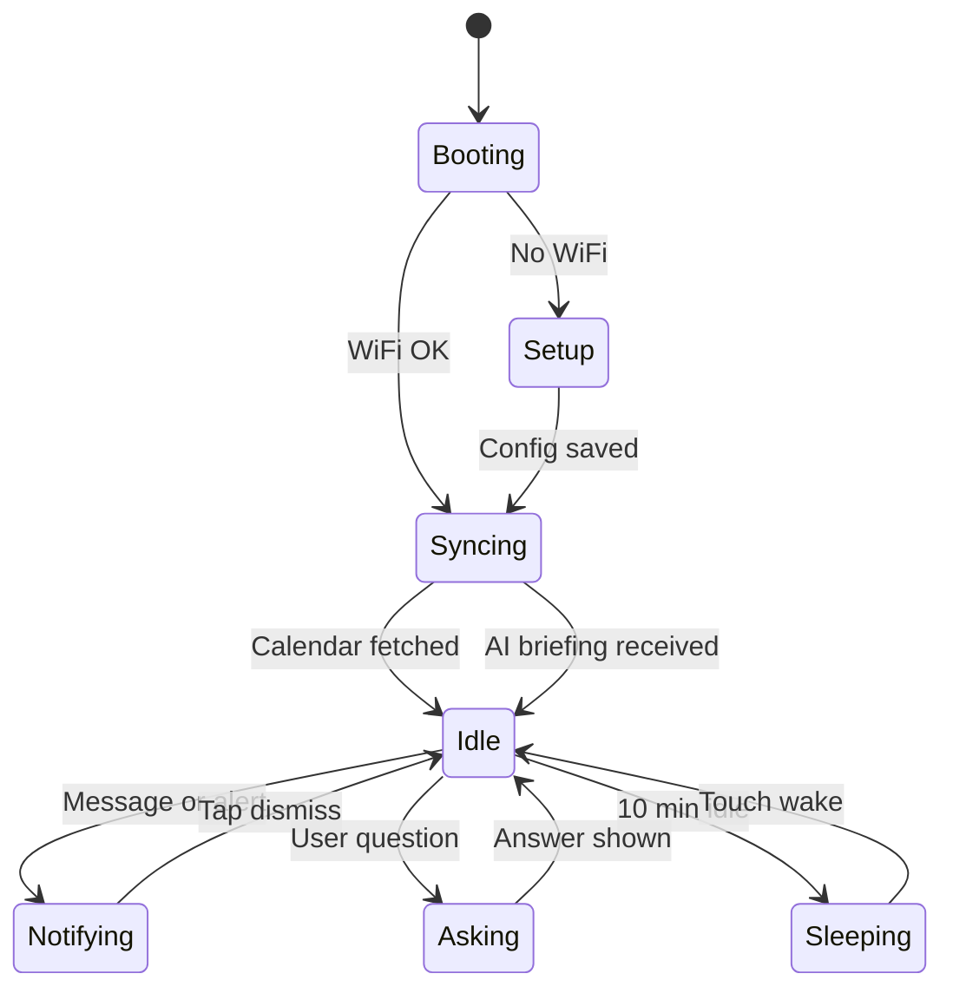

# AI Desk Companion — Requirements Document

| Field | Value |
|---|---|
| **Project** | ESP32 AI Desk Companion (POC) |
| **Version** | 0.1 (Draft for Review) |
| **Date** | 2026-08-17 |
| **Status** | Awaiting review |
| **Related** | [General Requirements](REQUIREMENTS.md) |

---

## 1. Executive Summary

This document defines the requirements for an **AI-powered desk companion** — a small physical device on your desk that combines **expressive presence**, **calendar awareness**, **message notifications**, and a **thin AI layer** for briefings and short interactions.

Unlike full AI agents (PopClaw, Loona Deskmate, Razer AVA), this product intentionally scopes AI to what an **ESP32-S3 round display** can support: the device is the **face and sensor layer**; intelligence runs on a **LAN gateway** or **cloud API**, not on the microcontroller itself.

### 1.1 Positioning

| Dimension | This product | PopClaw / OpenClaw | Loona Deskmate |
|---|---|---|---|
| Form factor | ESP32 round watch display | Custom / RPi companion | iPhone + motorized dock |
| AI depth | Briefings, reactions, short Q&A | Full personal agent | Screen-aware co-worker |
| Cost target | $25–75 DIY | $150+ | $220+ |
| Open source | Yes | Yes | No |
| Subscription | None (BYO API or local Ollama) | None | Credits for advanced tasks |

### 1.2 Design principle

> **The ESP32 is the face, not the brain.**

The device must feel alive and useful even when AI is unavailable. AI enhances notifications and calendar context — it is not required for core operation.

---

## 2. Vision

A desk companion that:

- Shows an animated face with moods and idle behavior
- Surfaces the next calendar event and alerts before meetings
- Receives short messages over Wi-Fi and Bluetooth
- Delivers a **one-line AI morning briefing** from today's schedule
- Reacts to messages with a **brief, personality-driven line**
- Answers **short questions** when prompted from a phone or HTTP client

The experience should be **glanceable, low-distraction, and charming** — not another chat window or voice assistant.

---

## 3. Minimum Viable Product (MVP)

### 3.1 MVP goal

Ship a working desk companion that demonstrates **physical presence + calendar + messaging + thin AI** in a single build cycle, using only Tier 1 hardware.

### 3.2 MVP hardware (Tier 1)

| # | Component | Qty | Est. Cost | Required for MVP |
|---|---|---|---|---|
| 1 | Waveshare ESP32-S3-Touch-LCD-1.28 | 1 | $15–25 | Yes |
| 2 | USB-C cable (data + power) | 1 | $3–5 | Yes |
| 3 | 3D-printed desk stand | 1 | $2–10 | Recommended |
| 4 | 3.7 V LiPo 400–800 mAh | 1 | $3–6 | Optional |
| 5 | Micro SD card | 1 | $3–5 | Optional |

**MVP hardware budget:** ~$25–35 (USB-powered, no extras).

**Explicitly deferred from MVP:** vibration motor, LED ring, external touch pads, speaker, microphone.

### 3.3 MVP feature layers

#### Layer A — Core (no AI required)

| ID | Feature | Description | Priority |
|---|---|---|---|
| MVP-A1 | Animated face | 3 moods: neutral, happy, alert; idle blink loop | Must |
| MVP-A2 | Wi-Fi provisioning | Captive portal (WiFiManager) on first boot | Must |
| MVP-A3 | Calendar sync | Poll private iCal URL every 10 min; cache locally | Must |
| MVP-A4 | Calendar UI | Next 3 events with title, time, countdown | Must |
| MVP-A5 | Calendar alert | Visual alert 5 min before next event | Must |
| MVP-A6 | HTTP messaging | `POST /api/message` on LAN | Must |
| MVP-A7 | BLE messaging | GATT write characteristic for short messages | Must |
| MVP-A8 | Touch gestures | Tap = dismiss; swipe = Face / Calendar / Messages | Must |
| MVP-A9 | Web config | Browser page to set iCal URL, bot name, timezone | Must |
| MVP-A10 | Status API | `GET /api/status` returns JSON health + next event | Should |

#### Layer B — AI integration (MVP differentiator)

| ID | Feature | Trigger | Output | Priority |
|---|---|---|---|---|
| MVP-B1 | Morning briefing | After first calendar sync of the day | ≤ 100 char summary on face screen | Must |
| MVP-B2 | Message reaction | On new message received | ≤ 80 char personality line | Must |
| MVP-B3 | Tap-to-ask | User sends question via BLE or HTTP | ≤ 120 char answer, scrollable | Should |
| MVP-B4 | Mood from AI | AI response includes mood hint | Face switches to happy / alert / sleepy | Should |
| MVP-B5 | AI fallback | Gateway unreachable | Show cached calendar; skip AI lines | Must |

#### Layer C — Explicitly out of MVP

| Feature | Reason deferred |
|---|---|
| Voice / wake word | No microphone on recommended board |
| On-device LLM | Insufficient PSRAM (2 MB) |
| Google OAuth on ESP32 | Use iCal URL instead |
| Full OpenClaw agent port | Requires RPi-class compute |
| Companion mobile app | Use nRF Connect + curl for testing |
| MQTT / remote push | LAN-only for MVP |
| Email, smart home, shell access | Out of product scope |
| Conversation memory across days | Adds state complexity |
| OTA firmware updates | Planned for v1.0 |

### 3.4 MVP success criteria

| # | Criterion | Target |
|---|---|---|
| SC-1 | Boot to animated face | < 10 s |
| SC-2 | Calendar events from iCal URL | Visible within 60 s of sync |
| SC-3 | Message via HTTP or BLE | On screen < 5 s |
| SC-4 | AI morning briefing | Generated within 15 s of calendar sync |
| SC-5 | Tap-to-ask response | Answer displayed < 8 s (LAN gateway) |
| SC-6 | AI unavailable | Device continues calendar + messaging without crash |
| SC-7 | Continuous USB operation | 8 h without reset |
| SC-8 | Touch gestures | Tap, swipe left/right, long-press recognized |

---

## 4. System Architecture

### 4.1 High-level diagram

```
┌─────────────────────────────────────────────────────────────────┐
│                    ESP32 AI DESK COMPANION                       │
│  ┌──────────┐  ┌──────────┐  ┌──────────┐  ┌───────────────┐  │
│  │ Round    │  │ Touch    │  │ IMU      │  │ Message       │  │
│  │ LCD Face │  │ CST816S  │  │ QMI8658  │  │ Queue         │  │
│  └────┬─────┘  └────┬─────┘  └────┬─────┘  └───────┬───────┘  │
│       └─────────────┴─────────────┴──────────────────┘            │
│                            │                                     │
│              ┌─────────────▼─────────────┐                       │
│              │   Application Layer       │                       │
│              │  UI · State · Animations    │                       │
│              └─────────────┬─────────────┘                       │
│              ┌─────────────▼─────────────┐                       │
│              │   Services Layer          │                       │
│              │  Calendar · Messaging     │                       │
│              │  AI Client (thin)         │                       │
│              └─────────────┬─────────────┘                       │
│              ┌─────────────▼─────────────┐                       │
│              │  Connectivity             │                       │
│              │  Wi-Fi · BLE · HTTP       │                       │
│              └───────────────────────────┘                       │
└──────────────────────────────┬──────────────────────────────────┘
                               │ HTTP (LAN)
          ┌────────────────────┼────────────────────┐
          │                    │                    │
    ┌─────▼─────┐      ┌───────▼───────┐    ┌──────▼──────┐
    │ Phone     │      │ AI Gateway    │    │ iCal URL    │
    │ BLE/curl  │      │ (RPi / PC)    │    │ (Google etc)│
    └───────────┘      └───────┬───────┘    └─────────────┘
                               │
                    ┌──────────▼──────────┐
                    │ Ollama (local)      │
                    │ or Cloud LLM API    │
                    │ (Gemini / GPT-mini) │
                    └─────────────────────┘
```

### 4.2 Component responsibilities

| Component | Role | Runs on |
|---|---|---|
| **ESP32 firmware** | Display, touch, BLE, calendar fetch, message queue, AI client | Device |
| **AI Gateway** | Prompt assembly, LLM call, response formatting, API key storage | LAN server (RPi, Mac, PC) |
| **iCal provider** | Calendar event source | Cloud (Google Calendar export URL) |
| **Phone / curl** | Send messages, ask questions, configure device | User device |

### 4.3 Why AI runs off-device

| Constraint | ESP32-S3 limit | Implication |
|---|---|---|
| PSRAM | 2 MB | Cannot run useful LLMs locally |
| Flash | 16 MB | No room for model weights |
| Microphone | Not on board | No voice input in MVP |
| Display | 240×240 round | Responses must be ≤ 120 characters |
| Power | 80–150 mA active | Long LLM inference would drain battery |

**Recommended MVP pattern:** LAN AI gateway (Option B). API keys never stored on ESP32.

---

## 5. AI Integration Design

### 5.1 AI architecture options

| Option | Pattern | MVP fit | Notes |
|---|---|---|---|
| **A — Cloud direct** | ESP32 → HTTPS → OpenAI/Gemini | Acceptable | API key on device; simplest but less secure |
| **B — LAN gateway** ⭐ | ESP32 → HTTP → local gateway → Ollama/cloud | **Recommended** | Keys on gateway; works with Ollama for free |
| **C — Phone as brain** | Phone calls LLM, sends result to ESP32 | Prototype only | Good for week-1 demo; not standalone |

**MVP recommendation:** Implement **Option B** as primary; support **Option A** as fallback for users without a LAN server.

### 5.2 AI task types

| Task | `type` value | When triggered | Max output |
|---|---|---|---|
| Daily briefing | `briefing` | Once after first calendar sync per day | 100 chars |
| Message reaction | `react` | On each new message | 80 chars |
| Question answer | `ask` | On user question via BLE/HTTP | 120 chars |
| Event summary | `event_alert` | 5 min before meeting (optional) | 60 chars |

### 5.3 System prompt (gateway-side)

```
You are {bot_name}, a brief desk companion with a warm, playful personality.
Rules:
- Respond in plain text only (no markdown, no lists, no emojis unless natural)
- Stay within the character limit for the task type
- Be helpful but concise — the user glances at a 1.28" round screen
- If you lack context, say so in one short sentence
- Never invent calendar events or messages not in the provided context
```

### 5.4 Example AI outputs

| Task | Context | Example output |
|---|---|---|
| Briefing | 2 meetings today, free after 3pm | `Light day — standup at 10, then clear until 3.` |
| React | Mom: "Dinner at 6" | `Mom's calling you to the table at 6!` |
| Ask | "When is my next meeting?" | `Team sync in 12 minutes.` |
| Event alert | Standup in 5 min | `Standup soon — grab your coffee.` |

### 5.5 AI failure behavior

| Condition | Device behavior |
|---|---|
| Gateway timeout (> 10 s) | Skip AI line; show raw message/event only |
| Gateway unreachable | Log once; retry on next trigger; no user-facing error spam |
| Empty AI response | Fall back to template: `"{sender}: {text}"` |
| Invalid mood in response | Default to `neutral` face |

---

## 6. API Specifications

### 6.1 Device HTTP API (ESP32)

Base URL: `http://<device-hostname>.local:8080`

#### `GET /api/status`

```json
{
  "name": "DeskBot",
  "wifi": true,
  "ble_connected": false,
  "battery_percent": null,
  "ai_gateway": "reachable",
  "next_event": {
    "title": "Team sync",
    "starts_in_sec": 720
  },
  "last_briefing": "Light day — one meeting at 10.",
  "firmware": "0.1.0"
}
```

#### `POST /api/message`

```json
{
  "sender": "Alex",
  "text": "Don't forget to stretch!",
  "priority": "normal"
}
```

Response: `201 Created`

```json
{
  "id": 3,
  "status": "queued",
  "ai_reaction": "Alex wants you to stretch — good advice!"
}
```

#### `POST /api/ask`

```json
{
  "question": "What's on my calendar this afternoon?"
}
```

Response: `200 OK`

```json
{
  "answer": "Design review at 2pm, then you're free.",
  "mood": "neutral"
}
```

#### `POST /api/config` (requires `X-API-Token` header)

```json
{
  "bot_name": "DeskBot",
  "ical_url": "https://calendar.google.com/calendar/ical/.../basic.ics",
  "timezone": "America/New_York",
  "ai_gateway_url": "http://desk-gateway.local:8090",
  "ai_enabled": true
}
```

#### `GET /setup`

HTML captive-style configuration page (iCal URL, bot name, gateway URL, Wi-Fi status).

### 6.2 BLE GATT service (ESP32)

| UUID (example) | Characteristic | Properties | Format |
|---|---|---|---|
| `6E400001-...` | DeskCompanion Service | — | — |
| `6E400002-...` | `MSG_CHAR` | Write, Notify | `sender\|text` |
| `6E400003-...` | `ASK_CHAR` | Write, Notify | Question UTF-8; notify returns answer |
| `6E400004-...` | `STATUS_CHAR` | Read, Notify | JSON status snapshot |

### 6.3 AI Gateway API (LAN server)

Base URL: `http://<gateway-host>:8090` (configurable)

#### `POST /api/ai`

Request:

```json
{
  "type": "briefing",
  "bot_name": "DeskBot",
  "events": [
    {
      "title": "Team sync",
      "start": "2026-08-17T10:00:00",
      "end": "2026-08-17T10:30:00"
    },
    {
      "title": "Design review",
      "start": "2026-08-17T14:00:00",
      "end": "2026-08-17T15:00:00"
    }
  ],
  "timezone": "America/New_York"
}
```

Response:

```json
{
  "text": "Two meetings today — sync at 10, review at 2.",
  "mood": "neutral"
}
```

#### `POST /api/ai` — react

```json
{
  "type": "react",
  "bot_name": "DeskBot",
  "sender": "Mom",
  "message": "Dinner at 6"
}
```

Response:

```json
{
  "text": "Mom says dinner at 6 — save room!",
  "mood": "happy"
}
```

#### `POST /api/ai` — ask

```json
{
  "type": "ask",
  "bot_name": "DeskBot",
  "question": "When is my next meeting?",
  "events": [ "...same as briefing..." ]
}
```

Response:

```json
{
  "text": "Team sync in 12 minutes.",
  "mood": "alert"
}
```

#### `GET /api/health`

```json
{
  "status": "ok",
  "provider": "ollama",
  "model": "gemma2:2b"
}
```

### 6.4 Gateway implementation options

| Stack | Language | LLM backend | Effort |
|---|---|---|---|
| **Minimal** | Python + FastAPI | Ollama | Low — recommended for MVP |
| **Node** | Express | OpenAI / Ollama | Low |
| **OpenClaw node** | OpenClaw Gateway | Any configured model | Medium — path to v1.0 |

---

## 7. User Experience

### 7.1 Screen flow (MVP)

| Screen | Content | Enter |
|---|---|---|
| **Face** (default) | Avatar + AI briefing line + next-event badge | Default |
| **Calendar** | Next 3 events with countdown | Swipe right |
| **Messages** | Inbox; tap to view + AI reaction | Swipe left |
| **Ask** | "Listening..." then answer card | Long-press, or BLE write to ASK_CHAR |

### 7.2 State machine



### 7.3 Personality behaviors (rule-based + AI)

| Trigger | Face behavior | AI involvement |
|---|---|---|
| Boot complete | Wake-up blink | None |
| Calendar synced (first today) | Look "thoughtful" | Briefing line |
| New message | Eyes widen | Reaction line |
| 5-min event alert | Alert mood | Optional event_alert line |
| Tap on face | Quick nod | None |
| Long idle (5 min) | Slow blink, sleepy | None |
| AI timeout | Confused expression 2s | None — show raw data |
| Wi-Fi lost | Sad/confused + spinner | None |

---

## 8. Software Stack

### 8.1 ESP32 firmware

| Layer | Technology |
|---|---|
| Tooling | PlatformIO + Arduino |
| UI | LVGL 9.x (round mask, sprites) |
| Display | GC9A01 + CST816S touch |
| Wi-Fi setup | WiFiManager |
| BLE | NimBLE-Arduino |
| HTTP server | ESPAsyncWebServer or WebServer |
| JSON | ArduinoJson |
| Calendar | Custom iCal parser (VEVENT) |
| Time | NTP + `TZ` string |
| Storage | NVS (config), LittleFS (event cache) |

### 8.2 AI gateway (reference implementation)

| Layer | Technology |
|---|---|
| Runtime | Python 3.11+ |
| Framework | FastAPI |
| LLM (local) | Ollama (`gemma2:2b` or `llama3.2:1b`) |
| LLM (cloud fallback) | Gemini 2.0 Flash / GPT-4o-mini |
| Config | `.env` file (API keys, model name) |
| Deployment | `systemd` service or Docker on RPi / PC |

### 8.3 Proposed repository structure

```
esp32-bot-poc/
├── docs/
│   ├── REQUIREMENTS.md
│   └── AI_DESK_COMPANION_REQUIREMENTS.md   ← this document
├── firmware/
│   ├── platformio.ini
│   └── src/
│       ├── main.cpp
│       ├── display/          # LVGL UI, faces, screens
│       ├── calendar/         # iCal fetch + parse + cache
│       ├── messaging/        # Queue, BLE, HTTP handlers
│       ├── ai/               # Thin AI client (HTTP to gateway)
│       └── connectivity/     # WiFi, BLE, HTTP server
└── gateway/
    ├── requirements.txt
    ├── main.py               # FastAPI AI gateway
    ├── prompts.py            # System prompts per task type
    └── providers/
        ├── ollama.py
        └── openai_compat.py
```

---

## 9. Development Phases

### Phase 0 — Hardware bring-up (3–5 days)

- [ ] Flash test sketch; verify display, touch, IMU
- [ ] Measure boot time and power draw
- [ ] Print or assemble desk stand

### Phase 1 — Core firmware, no AI (1–2 weeks)

- [ ] LVGL round face with 3 moods + idle animation
- [ ] WiFiManager captive portal
- [ ] NTP time sync
- [ ] HTTP `/api/message`, `/api/status`, `/setup`
- [ ] Touch: tap, swipe, long-press

### Phase 2 — Calendar + BLE (1 week)

- [ ] iCal URL fetch + VEVENT parse
- [ ] Calendar screen + 5-minute alert
- [ ] NimBLE GATT messaging service
- [ ] Local event cache (offline display)

### Phase 3 — AI gateway + integration (1 week)

- [ ] Python FastAPI gateway with Ollama provider
- [ ] ESP32 AI client: briefing, react, ask
- [ ] Mood mapping from gateway response
- [ ] AI failure fallbacks

### Phase 4 — Polish (post-MVP)

- [ ] Vibration motor on alert
- [ ] Companion PWA (send message, ask, configure)
- [ ] MQTT remote messaging
- [ ] OTA firmware updates
- [ ] OpenClaw gateway adapter

---

## 10. Testing Plan

| Test | Method | Pass criteria |
|---|---|---|
| Face render | Visual | Stable 30+ FPS idle animation |
| Wi-Fi setup | Phone browser | Connect in < 3 min |
| iCal sync | Known feed | Events match within 1 min |
| HTTP message | `curl POST` | On screen < 5 s |
| BLE message | nRF Connect write | On screen < 5 s |
| AI briefing | Gateway + Ollama | Line appears < 15 s after sync |
| AI react | Send message | Personality line < 8 s |
| AI ask | `POST /api/ask` | Answer < 120 chars, < 8 s |
| Gateway down | Stop gateway | Calendar + raw messages still work |
| Soak test | 8 h USB powered | No crash; heap stable |

### 10.1 Example test commands

```bash
# Send a message
curl -X POST http://deskbot.local:8080/api/message \
  -H "Content-Type: application/json" \
  -d '{"sender":"You","text":"Hello DeskBot!"}'

# Ask a question
curl -X POST http://deskbot.local:8080/api/ask \
  -H "Content-Type: application/json" \
  -d '{"question":"When is my next meeting?"}'

# Check gateway health
curl http://desk-gateway.local:8090/api/health
```

---

## 11. Security & Privacy

| Topic | MVP approach |
|---|---|
| API keys | Stored on gateway only (not ESP32) |
| Device config | Protected by generated API token in NVS |
| Calendar URL | Stored in NVS; never logged to serial in release builds |
| AI context | Only event titles/times and message text sent to gateway |
| BLE | No pairing PIN in MVP; add in v1.0 |
| HTTPS | Required for iCal fetch; HTTP OK for LAN gateway |
| Factory reset | Long-press BOOT button 10 s |

---

## 12. Competitive Landscape (AI Products)

### 12.1 Closest commercial peers

| Product | AI approach | Calendar | Open | Price |
|---|---|---|---|---|
| [PopClaw](https://www.popclaw.ai/) | OpenClaw agent, hybrid local/cloud | ✅ | ✅ | TBD |
| [ClawStage](https://clawstage.ai/) | OpenClaw on RPi 5 | ✅ | ✅ | ~$200+ |
| [Loona Deskmate](https://keyirobot.com/products/deskmate) | iPhone + cloud AI | ✅ | ❌ | ~$220 |
| [Cubie](https://www.gizmocrowd.com/) | On-device agent + cloud LLM | ⚠️ | ❌ | ~$179 |
| [Razer AVA](https://www.razer.com/razer-ava) | Grok, screen-aware | ✅ | ❌ | TBD |
| [M5Stack StackChan](https://shop.m5stack.com/) | ESP32-S3 + AI voice | ⚠️ | ✅ | ~$100 |

### 12.2 Differentiation

This project fills the gap: **sub-$75, ESP32-based, open-source AI desk companion** with calendar + messaging. No commercial product combines all four today.

---

## 13. Non-Functional Requirements

| ID | Category | Requirement |
|---|---|---|
| NFR-01 | Latency | AI response displayed within 8 s (LAN gateway) |
| NFR-02 | Availability | Core features work without AI gateway |
| NFR-03 | Reliability | 8 h continuous run without crash |
| NFR-04 | Response size | AI text ≤ 120 characters |
| NFR-05 | Cost | DIY build ≤ $75 (Tier 1 + gateway on existing PC) |
| NFR-06 | Privacy | No message content sent to cloud unless gateway configured for cloud LLM |
| NFR-07 | Maintainability | Firmware and gateway in separate directories |
| NFR-08 | Usability | First-time setup < 10 min with README guide |

---

## 14. Risks & Mitigations

| Risk | Impact | Mitigation |
|---|---|---|
| LLM responses too long for screen | High | Hard character limits in prompt + post-process truncate |
| Gateway not always running | Medium | Graceful fallback; device works without AI |
| iCal URL exposes calendar | Medium | Use private URL; document security in README |
| ESP32 heap exhaustion with LVGL + HTTP + BLE | High | Profile heap; disable features incrementally |
| Ollama slow on old hardware | Medium | Cloud fallback (Gemini Flash); cache briefing daily |
| BLE range insufficient | Low | HTTP API as primary for desk use |

---

## 15. Open Questions

| # | Question | Options | Decision |
|---|---|---|---|
| OQ-1 | Primary LLM provider for gateway? | Ollama local / Gemini Flash / both | _TBD_ |
| OQ-2 | Store API key on ESP32 for cloud-direct mode? | Yes (NVS encrypted) / No (gateway only) | _TBD_ |
| OQ-3 | Include `event_alert` AI line at 5 min? | Yes / No (visual only) | _TBD_ |
| OQ-4 | Gateway as separate repo or monorepo? | `gateway/` in this repo / separate | _TBD_ |
| OQ-5 | OpenClaw adapter in MVP or v1.0? | Phase 3 / Phase 4 | _TBD_ |

---

## 16. References

- [General Requirements (hardware, BOM, full API)](REQUIREMENTS.md)
- [Waveshare ESP32-S3-Touch-LCD-1.28 Wiki](https://www.waveshare.com/wiki/ESP32-S3-Touch-LCD-1.28)
- [OpenClaw](https://openclaw.ai/) — agent framework (v1.0 integration target)
- [PopClaw](https://www.popclaw.ai/) — commercial OpenClaw desk companion
- [LVGL Documentation](https://docs.lvgl.io/)
- [Ollama](https://ollama.com/) — local LLM runtime for gateway
- [iCalendar RFC 5545](https://datatracker.ietf.org/doc/html/rfc5545)

---

## 17. Document History

| Version | Date | Author | Changes |
|---|---|---|---|
| 0.1 | 2026-08-17 | Cloud Agent | Initial AI desk companion requirements |

---

## Appendix A — MVP checklist (printable)

```
□ ESP32 board flashed with face UI
□ Wi-Fi captive portal works
□ iCal URL configured; events visible
□ 5-minute alert fires
□ curl message appears on screen
□ nRF Connect BLE message works
□ AI gateway running (Ollama or cloud)
□ Morning briefing appears after sync
□ Message AI reaction appears
□ Ask question via curl; answer on screen
□ Stop gateway — device still shows calendar
□ 8-hour soak test passed
```

## Appendix B — Gateway environment variables

```bash
# gateway/.env.example
OLLAMA_BASE_URL=http://localhost:11434
OLLAMA_MODEL=gemma2:2b
OPENAI_API_KEY=           # optional cloud fallback
OPENAI_MODEL=gpt-4o-mini
DEFAULT_PROVIDER=ollama     # ollama | openai
HOST=0.0.0.0
PORT=8090
```
