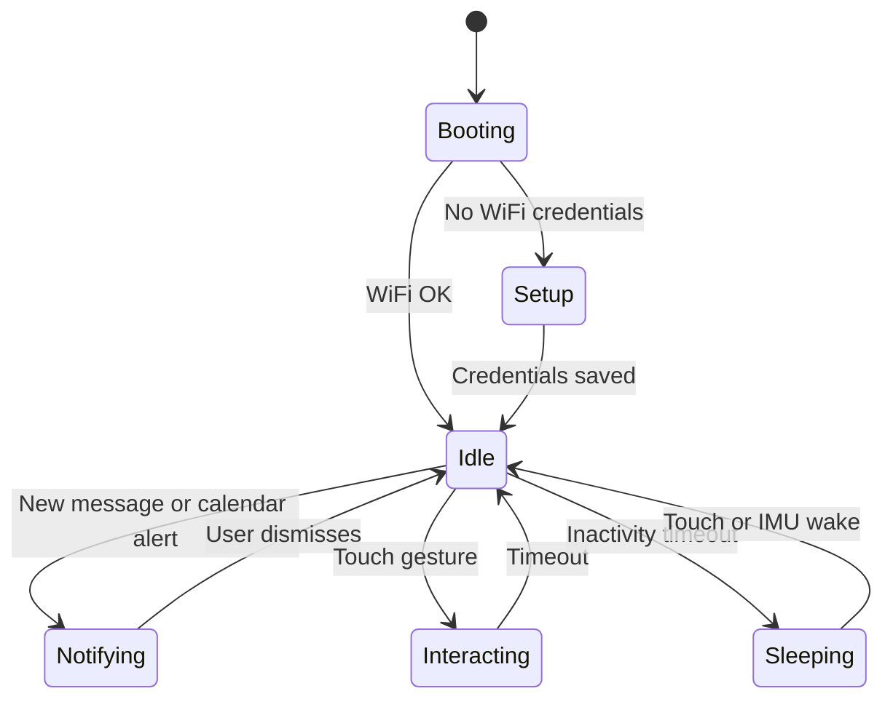

# Desk Companion Bot — Requirements Document

| Field | Value |
|---|---|
| **Project** | ESP32 Desk Companion Bot (POC) |
| **Version** | 0.1 (Draft for Review) |
| **Date** | 2026-08-16 |
| **Status** | Awaiting review |
| **Repository** | `esp32-bot-poc` |

---

## 1. Executive Summary

This document defines the requirements for a **personalized physical desk companion** — a small, expressive device that sits on a desk and acts as a persistent, low-distraction companion. The bot uses an **ESP32-based round watch-style display** as its face, responds to **touch and motion**, shows **calendar events**, and receives **text messages** over **Wi-Fi** and **Bluetooth**.

The goal of this POC is to validate hardware selection, interaction design, connectivity patterns, and a minimal but delightful user experience before committing to a custom enclosure and production firmware.

### 1.1 Vision

> A desk companion that feels alive — it glances at upcoming meetings, nudges you when messages arrive, reacts when you pet it, and rests quietly when you are focused — without becoming another screen you have to manage.

### 1.2 Success Criteria (POC)

| # | Criterion | Target |
|---|---|---|
| SC-1 | Device boots, connects to Wi-Fi, and shows a stable animated face within 10 s | Required |
| SC-2 | Calendar events from Google Calendar (or iCal feed) appear within 60 s of sync | Required |
| SC-3 | A text message delivered via companion app or BLE appears on screen within 5 s | Required |
| SC-4 | Touch gestures (tap, long-press, swipe) trigger distinct animations | Required |
| SC-5 | Device runs ≥ 8 h on battery during typical desk use, or indefinitely on USB power | Desired |
| SC-6 | Companion mobile app (or web dashboard) can push messages and configure behavior | Required |

---

## 2. Product Overview

### 2.1 Primary Use Cases

| ID | Use Case | Description |
|---|---|---|
| UC-1 | **Ambient calendar awareness** | Glanceable view of today's next event, countdown, and all-day reminders |
| UC-2 | **Message notifications** | Receive short text messages from phone or cloud without unlocking a phone |
| UC-3 | **Touch interaction** | Tap to acknowledge, long-press for menu, swipe to change face/mood |
| UC-4 | **Desk presence** | Idle animations, sleep when unattended, wake on touch or motion |
| UC-5 | **Personalization** | Custom name, avatar/face style, notification preferences |

### 2.2 Out of Scope (POC)

- Voice assistant / microphone input
- Two-way SMS or carrier integration
- Multi-user accounts on a single device
- OTA firmware updates (planned for v1.0, not POC)
- Custom PCB design
- Cloud video/voice calling

### 2.3 Target User

Individuals who want a **charming, physical notification surface** on their desk — developers, remote workers, students — who already use Google Calendar (or similar) and are comfortable with a one-time Wi-Fi setup.

---

## 3. Recommended Hardware

### 3.1 Core Board (Recommended)

**Primary recommendation: Waveshare ESP32-S3-Touch-LCD-1.28**

| Spec | Detail |
|---|---|
| MCU | ESP32-S3 (dual-core LX7, up to 240 MHz) |
| Display | 1.28" round IPS LCD, 240×240, GC9A01 (SPI) |
| Touch | CST816S capacitive touch (I²C) |
| IMU | QMI8658 6-axis accelerometer + gyroscope |
| Wireless | Wi-Fi 802.11 b/g/n, Bluetooth 5 LE |
| Memory | 16 MB Flash, 2 MB PSRAM |
| Power | USB-C, onboard Li-ion charge circuit (MX1.25) |
| GPIO | 6 pins via SH1.0 connector |

**Why this board:** It integrates the round "watch face" display, touch, IMU, Wi-Fi, and BLE in a single compact module — ideal for a desk bot "head." The round form factor reads as a face/avatar rather than a rectangular screen.

**Alternatives:**

| Board | Trade-off |
|---|---|
| ESP32-S3-LCD-1.28 (non-touch) | Lower cost; requires external touch or button-only input |
| ESP32-S3-Touch-LCD-1.46 / 1.85 | Larger face, more UI space; bigger desk footprint |
| LilyGO T-Watch S3 | More watch-oriented enclosure; fewer expansion GPIOs |
| ESP32 + separate GC9A01 round module | More wiring; better for custom enclosure later |

### 3.2 Bill of Materials (BOM)

#### Tier 1 — Minimum Viable Desk Bot

| # | Component | Qty | Est. Cost | Purpose |
|---|---|---|---|---|
| 1 | ESP32-S3-Touch-LCD-1.28 | 1 | $15–25 | Brain + face + touch + IMU |
| 2 | 3.7 V LiPo battery (400–800 mAh, JST/MX1.25) | 1 | $3–6 | Portable / cord-free desk use |
| 3 | USB-C cable (data + power) | 1 | $3–5 | Flashing, charging, always-on power |
| 4 | Micro SD card (optional, 4–16 GB) | 1 | $3–5 | Asset storage, offline calendar cache |
| 5 | 3D-printed desk stand / bot body | 1 | $2–10 | Tilt display toward user; personality |

**Tier 1 estimated total:** ~$25–50 (excluding 3D print filament)

#### Tier 2 — Enhanced Companion (Recommended for Review Build)

| # | Component | Qty | Est. Cost | Purpose |
|---|---|---|---|---|
| 6 | Mini vibration motor (coin type, 3 V) | 1 | $1–2 | Haptic feedback on message / alarm |
| 7 | MOSFET or transistor driver (if not using GPIO switch) | 1 | $0.50 | Drive motor from GPIO |
| 8 | WS2812B RGB LED ring (12 LEDs, 30 mm) or single NeoPixel | 1 | $3–6 | Mood lighting, notification glow |
| 9 | TTP223 capacitive touch pad (standalone) | 1–3 | $1 each | "Pet" zones on bot body (head, hand) |
| 10 | Small speaker (8 Ω, 0.5–1 W) + PAM8302 amplifier | 1 set | $3–6 | Chimes, notification sounds |
| 11 | TP4056 + protection (if not using onboard charger) | 0–1 | $1 | Backup charge module for custom battery pack |
| 12 | Magnetic USB-C breakaway adapter | 1 | $5–8 | Safer cable disconnect on a moving desk bot |

**Tier 2 estimated total:** ~$40–75

#### Tier 3 — Future / Production Considerations

| Component | Purpose |
|---|---|
| Custom PCB carrier board | Clean integration of motor, LEDs, touch pads |
| INMP441 I²S microphone | Voice commands (v2.0) |
| BME280 environmental sensor | Temperature/humidity reactive moods |
| Real-time clock (DS3231) + coin cell | Reliable time when Wi-Fi unavailable |
| NFC tag (NTAG213) | Tap phone to pair or send quick messages |

### 3.3 Mechanical / Enclosure Concepts

```
        ┌─────────────┐
        │  ( ◕    ◕ ) │  ← Round LCD "face" (1.28")
        │     ∪       │
        └──────┬──────┘
               │ neck
          ┌────┴────┐
          │  body   │  ← Touch pads, LED ring, battery
          │ ◇  ◇    │
          └────┬────┘
               │ weighted base (anti-tip)
          ═════╧═════
```

**Enclosure requirements:**

- Display tilt: 15–25° toward user
- Access to USB-C for flashing without disassembly
- Ventilation gap if speaker installed
- Base weight ≥ 50 g or non-slip pad to prevent tip-over
- Touch pad exposure on top/side of head for "pet" interaction

### 3.4 Power Budget (Estimate)

| State | Current (approx.) | Notes |
|---|---|---|
| Active (display on, Wi-Fi connected) | 80–150 mA | Depends on backlight level |
| Idle (dim display, light sleep) | 20–40 mA | RTC + touch wake |
| Deep sleep | < 1 mA | Wake on touch IRQ or IMU |
| 500 mAh battery | ~3–6 h active, ~12–24 h mixed | USB power recommended for desk |

---

## 4. System Architecture

### 4.1 High-Level Block Diagram

```
┌──────────────────────────────────────────────────────────────────┐
│                     DESK COMPANION DEVICE (ESP32-S3)              │
│  ┌─────────┐  ┌──────────┐  ┌─────────┐  ┌──────────────────┐  │
│  │ Round   │  │ Touch    │  │ IMU     │  │ Optional: motor, │  │
│  │ LCD     │  │ (CST816S)│  │ QMI8658 │  │ LED, speaker     │  │
│  └────┬────┘  └────┬─────┘  └────┬────┘  └────────┬─────────┘  │
│       └────────────┴─────────────┴────────────────┘              │
│                            │                                      │
│              ┌─────────────▼─────────────┐                        │
│              │   Application Layer       │                        │
│              │  UI · State · Animations  │                        │
│              └─────────────┬─────────────┘                        │
│              ┌─────────────▼─────────────┐                        │
│              │   Connectivity Layer      │                        │
│              │  Wi-Fi · BLE · HTTP/MQTT  │                        │
│              └─────────────┬─────────────┘                        │
│              ┌─────────────▼─────────────┐                        │
│              │   Storage / Config (NVS)  │                        │
│              └───────────────────────────┘                        │
└──────────────────────────────┬───────────────────────────────────┘
                               │
          ┌────────────────────┼────────────────────┐
          │                    │                    │
    ┌─────▼─────┐      ┌───────▼───────┐    ┌──────▼──────┐
    │ Home Wi-Fi │      │ Phone (BLE)   │    │ Cloud /     │
    │            │      │ Companion App │    │ Relay API   │
    └─────┬─────┘      └───────────────┘    └──────┬──────┘
          │                                         │
    ┌─────▼─────────────────────────────────────────▼─────┐
    │  Calendar Provider (Google Calendar API / iCal URL)  │
    │  Message Relay (MQTT broker or lightweight REST API) │
    └─────────────────────────────────────────────────────┘
```

### 4.2 Software Stack (Recommended)

| Layer | Technology | Rationale |
|---|---|---|
| Framework | **PlatformIO** + **Arduino** or **ESP-IDF** | Fast prototyping; rich library ecosystem |
| UI / Graphics | **LVGL 9.x** | Optimized for embedded; animations, fonts, touch |
| Display driver | `lvgl/esp_lcd_gc9a01` + CST816S touch port | Matches Waveshare hardware |
| Wi-Fi provisioning | **WiFiManager** or ESP-IDF SmartConfig | Captive portal for home setup |
| TLS | mbedTLS (built-in) | HTTPS for calendar API |
| BLE | NimBLE-Arduino | Lower RAM than Bluedroid; GATT services |
| JSON | ArduinoJson | Calendar/message parsing |
| Time sync | NTP (`pool.ntp.org`) | Event countdown accuracy |
| OTA (v1.0) | ESP HTTPS OTA | Post-POC |

**Alternative:** MicroPython + LVGL binding — faster iteration, higher RAM use; acceptable for POC if performance is sufficient.

### 4.3 Connectivity Design

#### 4.3.1 Wi-Fi Responsibilities

| Function | Protocol | Direction |
|---|---|---|
| Calendar sync | HTTPS (Google Calendar API v3) or plain HTTP (private iCal URL) | Device → Cloud |
| Message push | MQTT over TLS (preferred) or HTTPS long-poll | Cloud → Device |
| Time sync | NTP UDP | Device → NTP server |
| Initial setup | Captive portal (WiFiManager) | Phone → Device |

#### 4.3.2 Bluetooth LE Responsibilities

| Function | GATT Role | Notes |
|---|---|---|
| Proximity pairing | Peripheral | Device advertises `DeskCompanion` service |
| Quick message from phone | Writable characteristic `MSG_CHAR` | Max 160 chars UTF-8 |
| Mood / command | Writable characteristic `CMD_CHAR` | e.g. `MOOD:happy`, `ACK` |
| Status read | Readable characteristic `STATUS_CHAR` | Battery %, Wi-Fi state, next event title |
| Notification mirror (optional) | Phone acts as central | Requires companion app with notification access (Android) |

#### 4.3.3 Message Path Options

**Option A — Companion app + MQTT (Recommended)**

```
Phone App ──publish──► MQTT Broker (e.g. HiveMQ Cloud, Mosquitto) ──subscribe──► ESP32
```

- Works over internet when phone is away from desk
- Broker can fan out to multiple bots later

**Option B — Direct BLE**

```
Phone ──BLE GATT write──► ESP32 (range ~5–10 m)
```

- No cloud dependency
- Phone must be nearby

**Option C — Local REST on LAN**

```
Phone / script ──HTTP POST /message──► ESP32 HTTP server (port 8080)
```

- Simple for home automation integration (Home Assistant, shortcuts)

**POC recommendation:** Implement **B + C** first (no cloud account required), add **A** for remote messaging in phase 2.

### 4.4 Calendar Integration

| Method | Pros | Cons |
|---|---|---|
| **Google Calendar API** (OAuth device flow or service account) | Rich metadata, recurring events | OAuth complexity on ESP32 |
| **Public / private iCal URL** | Simple HTTP GET, easy to parse | Limited fields; refresh polling only |
| **CalDAV** | Standard | Heavy for ESP32 |

**POC recommendation:** Start with **iCal URL polling** (every 5–15 min + on wake). Parse `VEVENT` for `SUMMARY`, `DTSTART`, `DTEND`, `LOCATION`. Display next 3 events.

**Display rules:**

- Show next event title + time until start (e.g. "Standup in 12 min")
- All-day events shown as banner
- 5-minute warning: animation + optional vibration
- Past events auto-removed from view

---

## 5. Functional Requirements

### 5.1 Display & UI

| ID | Requirement | Priority |
|---|---|---|
| FR-D-01 | Render round UI masked to circular display | Must |
| FR-D-02 | Support ≥ 3 face moods: neutral, happy, sleepy, alert | Must |
| FR-D-03 | Idle animation loop when no notifications (blink, bounce) | Must |
| FR-D-04 | Calendar card: event title, start time, countdown | Must |
| FR-D-05 | Message card: sender label + message text (scroll if long) | Must |
| FR-D-06 | Status bar: battery %, Wi-Fi icon, BLE connected dot | Should |
| FR-D-07 | Brightness auto-dim after 5 min idle; restore on touch | Should |
| FR-D-08 | Night mode (reduced brightness + muted colors) 22:00–07:00 | Could |

### 5.2 Touch & Motion Input

| ID | Requirement | Priority |
|---|---|---|
| FR-T-01 | **Tap** on face → dismiss notification or cycle info screen | Must |
| FR-T-02 | **Long press** (≥ 800 ms) → open quick settings (brightness, mood) | Must |
| FR-T-03 | **Swipe left/right** → switch screens: Face / Calendar / Messages | Must |
| FR-T-04 | **Double tap** → force calendar refresh | Should |
| FR-T-05 | IMU shake → surprised animation + "Are you okay?" toast | Could |
| FR-T-06 | External touch pad on body → "pet" animation + happy mood | Should |
| FR-T-07 | Pick-up detection (IMU) → wake from sleep | Should |

### 5.3 Calendar

| ID | Requirement | Priority |
|---|---|---|
| FR-C-01 | Fetch events from configured iCal URL or Google Calendar | Must |
| FR-C-02 | Store events locally (SPIFFS/LittleFS) for offline display | Should |
| FR-C-03 | Sync interval configurable (default 10 min) | Must |
| FR-C-04 | Show countdown to next event | Must |
| FR-C-05 | Pre-event alert at configurable offset (default 5 min) | Must |
| FR-C-06 | Support timezone via NTP + `TZ` string | Must |

### 5.4 Messaging

| ID | Requirement | Priority |
|---|---|---|
| FR-M-01 | Receive message up to 160 characters via BLE | Must |
| FR-M-02 | Receive message via HTTP POST `/api/message` on local network | Must |
| FR-M-03 | Display sender name + body + timestamp | Must |
| FR-M-04 | Queue up to 10 messages; oldest dropped on overflow | Should |
| FR-M-05 | Optional vibration / sound on new message | Should |
| FR-M-06 | MQTT subscription for remote push (phase 2) | Could |
| FR-M-07 | Tap to mark message as read | Must |

### 5.5 Connectivity & Setup

| ID | Requirement | Priority |
|---|---|---|
| FR-N-01 | Wi-Fi setup via captive portal on first boot | Must |
| FR-N-02 | Persist Wi-Fi credentials in NVS | Must |
| FR-N-03 | BLE advertising when not paired; GATT services when connected | Must |
| FR-N-04 | HTTP status endpoint `GET /api/status` returning JSON | Should |
| FR-N-05 | Configuration portal: iCal URL, bot name, timezone | Must |
| FR-N-06 | Reconnect Wi-Fi automatically on disconnect | Must |

### 5.6 Power Management

| ID | Requirement | Priority |
|---|---|---|
| FR-P-01 | USB-C powered operation without battery | Must |
| FR-P-02 | Battery charging while USB connected | Must |
| FR-P-03 | Report battery voltage / percentage | Should |
| FR-P-04 | Light sleep when idle > 10 min; wake on touch | Should |
| FR-P-05 | Deep sleep optional (user setting) | Could |

---

## 6. Non-Functional Requirements

| ID | Category | Requirement |
|---|---|---|
| NFR-01 | **Latency** | New BLE message shown within 2 s of write |
| NFR-02 | **Reliability** | 24 h continuous run without crash (watchdog enabled) |
| NFR-03 | **Security** | HTTPS for calendar; WPA2+ Wi-Fi; optional API token for HTTP |
| NFR-04 | **Privacy** | No message content logged to serial in production build |
| NFR-05 | **Maintainability** | Modular code: `display/`, `connectivity/`, `calendar/`, `input/` |
| NFR-06 | **Usability** | First-time setup completable in < 5 min without PC |
| NFR-07 | **Recoverability** | Factory reset: long-press boot button 10 s |
| NFR-08 | **Temperature** | Safe operation 0–40 °C ambient |

---

## 7. State Machine & Behavior

### 7.1 Device States



### 7.2 Screen Flow

| Screen | Content | Enter |
|---|---|---|
| **Face** (default) | Animated avatar + subtle next-event badge | Default / swipe from Calendar |
| **Calendar** | List of next 3 events | Swipe right from Face |
| **Messages** | Message inbox | Swipe left from Face |
| **Settings** | Brightness, sync, mood, about | Long press |

### 7.3 Personality / Acting Behaviors

| Trigger | Behavior |
|---|---|
| New message | Eyes widen → show message card → optional wiggle |
| Calendar alert (5 min) | Look at "clock" direction → pulse ring LED |
| Pet touch pad | Happy eyes + blush + short purr vibration |
| Long idle | Slow blink → half-closed eyes (sleepy) |
| Wi-Fi lost | Confused expression + retry spinner |
| Acknowledge tap | Quick nod animation |

---

## 8. API Specifications (Device)

### 8.1 HTTP API (LAN)

Base URL: `http://<device-ip>:8080`

#### `POST /api/message`

```json
{
  "sender": "Alex",
  "text": "Don't forget to stretch!",
  "priority": "normal"
}
```

**Response:** `201 Created`

```json
{ "id": 3, "status": "queued" }
```

#### `GET /api/status`

```json
{
  "name": "DeskBot",
  "wifi": true,
  "ble_connected": false,
  "battery_percent": 78,
  "next_event": {
    "title": "Team sync",
    "starts_in_sec": 720
  },
  "firmware": "0.1.0"
}
```

#### `POST /api/config` (requires `X-API-Token` header)

```json
{
  "ical_url": "https://calendar.google.com/calendar/ical/.../basic.ics",
  "bot_name": "DeskBot",
  "timezone": "America/New_York"
}
```

### 8.2 BLE GATT Service

| UUID (example) | Characteristic | Properties |
|---|---|---|
| `6E400001-...` | Service: DeskCompanion | — |
| `6E400002-...` | `MSG_CHAR` | Write, Notify |
| `6E400003-...` | `CMD_CHAR` | Write |
| `6E400004-...` | `STATUS_CHAR` | Read, Notify |

**Message format (UTF-8):** `sender|text` (e.g. `Mom|Dinner at 6`)

---

## 9. Companion App Requirements (Phase 2)

| ID | Requirement | Platform |
|---|---|---|
| APP-01 | BLE scan + pair with desk bot | iOS / Android |
| APP-02 | Send quick message form | Both |
| APP-03 | Configure iCal URL and Wi-Fi (fallback) | Both |
| APP-04 | Push via MQTT when off-LAN | Both |
| APP-05 | Android: optional notification listener → forward to bot | Android only |

**POC shortcut:** Use **nRF Connect** (BLE) + **curl** (HTTP) instead of a full app for initial testing.

---

## 10. Firmware Project Structure (Proposed)

```
firmware/
├── platformio.ini
├── src/
│   ├── main.cpp
│   ├── config.h                 # Pins, URLs, secrets (gitignored)
│   ├── display/
│   │   ├── ui_manager.cpp       # LVGL screens
│   │   ├── faces.cpp            # Avatar animations
│   │   └── assets/              # Fonts, images (C arrays)
│   ├── input/
│   │   ├── touch_handler.cpp
│   │   └── imu_gestures.cpp
│   ├── connectivity/
│   │   ├── wifi_manager.cpp
│   │   ├── ble_service.cpp
│   │   ├── http_server.cpp
│   │   └── mqtt_client.cpp      # Phase 2
│   ├── calendar/
│   │   ├── ical_parser.cpp
│   │   └── event_store.cpp
│   └── messaging/
│       └── message_queue.cpp
├── include/
└── test/
```

### 10.1 Key Dependencies (`platformio.ini`)

```ini
[env:esp32-s3-touch-lcd-128]
platform = espressif32
board = esp32-s3-devkitc-1
framework = arduino
lib_deps =
    lvgl/lvgl @ ^9.1.0
    bblanchon/ArduinoJson @ ^7.0.0
    tzapu/WiFiManager @ ^2.0.0
    h2zero/NimBLE-Arduino @ ^1.4.0
build_flags =
    -D LV_CONF_INCLUDE_SIMPLE
    -D BOARD_HAS_PSRAM
monitor_speed = 115200
```

---

## 11. Development Phases

### Phase 0 — Hardware Bring-Up (Week 1)

- [ ] Flash factory test sketch; verify display, touch, IMU
- [ ] Measure power consumption (active vs sleep)
- [ ] Print or assemble desk stand enclosure
- [ ] Optional: wire vibration motor + LED to GPIO

### Phase 1 — Core Firmware (Weeks 2–3)

- [ ] LVGL round UI with face animation
- [ ] Touch gestures (tap, long-press, swipe)
- [ ] WiFiManager captive portal
- [ ] NTP time sync
- [ ] HTTP `/api/message` + `/api/status`

### Phase 2 — Calendar & BLE (Weeks 4–5)

- [ ] iCal fetch + parse + local cache
- [ ] Calendar screen + 5-minute alerts
- [ ] NimBLE GATT service for messages
- [ ] Message queue + notification UI

### Phase 3 — Polish & Companion (Week 6+)

- [ ] IMU gestures (shake, pick-up wake)
- [ ] External touch pad "pet" interaction
- [ ] Sound / vibration patterns
- [ ] MQTT remote messaging
- [ ] Minimal mobile companion app or PWA

---

## 12. Testing Plan

| Test | Method | Pass Criteria |
|---|---|---|
| Display render | Visual | No tearing; ≥ 30 FPS on animations |
| Touch accuracy | Tap grid test | ≥ 95% hit accuracy center screen |
| Wi-Fi reconnect | Disable AP 60 s | Auto-reconnect < 30 s |
| Calendar sync | Known iCal feed | Events match source within 1 min |
| BLE message | nRF Connect write | Appears on screen < 2 s |
| HTTP message | curl POST | 201 + displayed |
| Soak test | 24 h powered | No reset; heap stable |
| Battery life | 500 mAh, mixed use | ≥ 4 h documented |

---

## 13. Risks & Mitigations

| Risk | Impact | Mitigation |
|---|---|---|
| Google OAuth on ESP32 is complex | High | Use iCal URL for POC |
| 240×240 display too small for long text | Medium | Marquee scroll; truncate with ellipsis |
| PSRAM limitations with LVGL | Medium | Use indexed colors; limit sprite count |
| BLE range insufficient | Low | Complement with Wi-Fi HTTP API |
| CST816S touch palm rejection | Low | Software debounce; ignore edge touches |
| Calendar API rate limits | Low | Cache aggressively; 10 min poll interval |

---

## 14. Security & Privacy

- Store Wi-Fi password and API tokens in **NVS encrypted partition** (ESP-IDF) or WiFiManager secure flag
- Use **TLS** for all external HTTP (calendar, MQTT)
- Local HTTP API protected by optional **API token** (generated on first boot, shown on settings screen)
- **No persistent cloud storage** of messages in POC; MQTT broker retention = 0
- Provide **factory reset** to clear credentials

---

## 15. Open Questions for Review

| # | Question | Options | Decision |
|---|---|---|---|
| OQ-1 | Primary calendar source? | iCal URL / Google OAuth / both | _TBD_ |
| OQ-2 | Cloud message relay? | MQTT SaaS / self-hosted / none | _TBD_ |
| OQ-3 | Companion app scope? | Full app / PWA / BLE tool only | _TBD_ |
| OQ-4 | Enclosure style? | Minimal stand / character body / custom | _TBD_ |
| OQ-5 | Framework? | Arduino+LVGL / ESP-IDF / MicroPython | _TBD_ |
| OQ-6 | Name / branding? | DeskBot / other | _TBD_ |

---

## 16. References

- [Waveshare ESP32-S3-Touch-LCD-1.28 Wiki](https://www.waveshare.com/wiki/ESP32-S3-Touch-LCD-1.28)
- [LVGL Documentation](https://docs.lvgl.io/)
- [ESP32-S3 Technical Reference](https://www.espressif.com/sites/default/files/documentation/esp32-s3_technical_reference_manual_en.pdf)
- [NimBLE-Arduino](https://github.com/h2zero/NimBLE-Arduino)
- [iCalendar RFC 5545](https://datatracker.ietf.org/doc/html/rfc5545)
- [Google Calendar iCal export](https://support.google.com/calendar/answer/37183)

---

## 17. Document History

| Version | Date | Author | Changes |
|---|---|---|---|
| 0.1 | 2026-08-16 | Cloud Agent | Initial draft for review |

---

## Appendix A — Quick Start Shopping List

Copy-paste order list for the recommended review build:

1. Waveshare **ESP32-S3-Touch-LCD-1.28** × 1
2. **3.7 V 500 mAh** LiPo (MX1.25 or JST) × 1
3. **Coin vibration motor** 3 V × 1
4. **WS2812B** 12-LED ring 30 mm × 1
5. **TTP223** touch sensor module × 2
6. **8 Ω mini speaker** + **PAM8302** breakout × 1
7. USB-C cable × 1
8. 3D print filament for desk stand (PLA/PETG) — ~30 g

## Appendix B — Example curl Commands (POC Testing)

```bash
# Send a message
curl -X POST http://deskbot.local:8080/api/message \
  -H "Content-Type: application/json" \
  -d '{"sender":"You","text":"Hello DeskBot!"}'

# Check status
curl http://deskbot.local:8080/api/status
```
